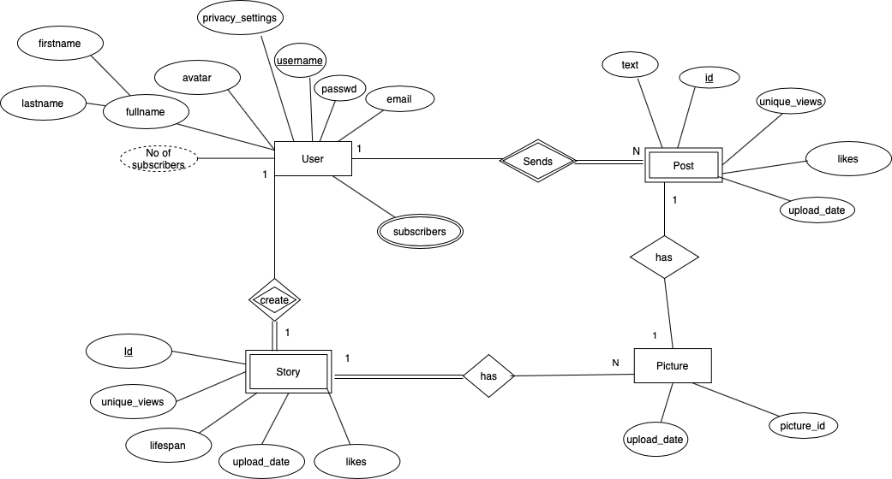
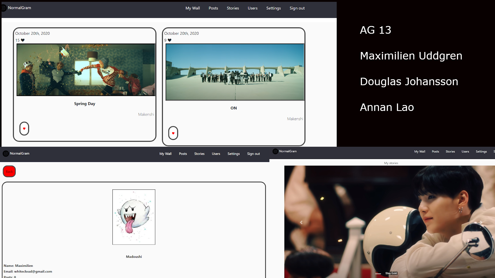

# Backend and Frontend Template

Latest version: https://git.ita.chalmers.se/courses/dit341/group-00-web (public Github [mirror](https://github.com/dit341/group-00-web))

## Project Structure

| File        | Purpose           | What you do?  |
| ------------- | ------------- | ----- |
| `server/` | Backend server code | All your server code |
| [server/README.md](server/README.md) | Everything about the server | **READ ME** carefully! |
| `client/` | Frontend client code | All your client code |
| [client/README.md](client/README.md) | Everything about the client | **READ ME** carefully! |
| [docs/DEPLOYMENT.md](docs/DEPLOYMENT.md) | Free online production deployment | Deploy your app online in production mode |
| [docs/LOCAL_DEPLOYMENT.md](docs/LOCAL_DEPLOYMENT.md) | Local production deployment | Deploy your app local in production mode |

## Requirements

The version numbers in brackets indicate the tested versions but feel free to use more recent versions.
You can also use alternative tools if you know how to configure them (e.g., Firefox instead of Chrome).

* [Git](https://git-scm.com/) (v2) => [installation instructions](https://www.atlassian.com/git/tutorials/install-git)
  * [Add your Git username and set your email](https://docs.gitlab.com/ce/gitlab-basics/start-using-git.html#add-your-git-username-and-set-your-email)
    * `git config --global user.name "YOUR_USERNAME"` => check `git config --global user.name`
    * `git config --global user.email "email@example.com"` => check `git config --global user.email`
  * > **Windows users**: We recommend to use the [Git Bash](https://www.atlassian.com/git/tutorials/git-bash) shell from your Git installation or the Bash shell from the [Windows Subsystem for Linux](https://docs.microsoft.com/en-us/windows/wsl/install-win10) to run all shell commands for this project.
* [Chalmers GitLab](https://git.ita.chalmers.se/) => Login with your **Chalmers CID** choosing "Sign in with" **Chalmers Login**. (contact [support@chalmers.se](mailto:support@chalmers.se) if you don't have one)
  * DIT341 course group: https://git.ita.chalmers.se/courses/dit341
  * [Setup SSH key with Gitlab](https://docs.gitlab.com/ee/ssh/)
    * Create an SSH key pair `ssh-keygen -t ed25519 -C "email@example.com"` (skip if you already have one)
    * Add your public SSH key to your Gitlab profile under https://git.ita.chalmers.se/profile/keys
    * Make sure the email you use to commit is registered under https://git.ita.chalmers.se/profile/emails
  * Checkout the [Backend-Frontend](https://git.ita.chalmers.se/courses/dit341/group-00-web) template `git clone git@git.ita.chalmers.se:courses/dit341/group-00-web.git`
* [Server Requirements](./server/README.md#Requirements)
* [Client Requirements](./client/README.md#Requirements)

## Getting started

```bash
# Clone repository
git clone git@git.ita.chalmers.se:courses/dit341/group-00-web.git

# Change into the directory
cd group-00-web

# Setup backend
cd server && npm install
npm run dev

# Setup frontend
cd client && npm install
npm run serve
```

> Check out the detailed instructions for [backend](./server/README.md) and [frontend](./client/README.md).

## Visual Studio Code (VSCode)

Open the `server` and `client` in separate VSCode workspaces or open the combined [backend-frontend.code-workspace](./backend-frontend.code-workspace). Otherwise, workspace-specific settings don't work properly.

## System Definition (MS0)

### Purpose

Normalgram is a social network which exhibits the opposite feature to Instagram. The problem with instagram is that it showcases only models and unreachable standards of beauty, which messes with one’s psyches and makes one feel bad about themselves. The stories that last longer and pictures with fewer likes are the center of the Normalgram community. The purpose of Normalgram is to put normal users at the center of attention instead of influencers, encouraging them to showcase their real life regardless of popularity, contributing to a more diverse and equal society.

### Pages

* Signup page: this page is a simple signup page. The user can create a new account here by entering a username and a password. The username needs to not be used previously.

* Login page: this page is a simple login page. The user can enter his username and password to log into his account.

*   Normal highlights page: this page showcases the most normal pictures and posts(chosen by the algorithm) and the longest surviving stories on the platform. Users can view stories by clicking on them, and access the profile of the people that have posted these stories/posts or pictures.

*   Follower page: very similarly to instagram or facebook, shows the latest visible posts/pictures and stories of the people you follow. The user can click on the stories icon to see them in full screen.

*   Personal settings page: the page where the user can change their personal settings. Here the user can modify his avatar, change his password, delete his account, make his account public or private or modify his personal information.

*   Personal page: Similar to the wall on facebook, this is the personal page of the user where he can see all his latest posts, pictures and surviving stories. The user can delete any pictures or posts that has not been previously deleted.

*   Upload: Page where user can upload new pictures, posts or stories by clicking on the corresponding buttons.

All pages except for the login and signup page can be accessed via the menu on top of every page.


### Entity-Relationship (ER) Diagram



## Teaser (MS3)


